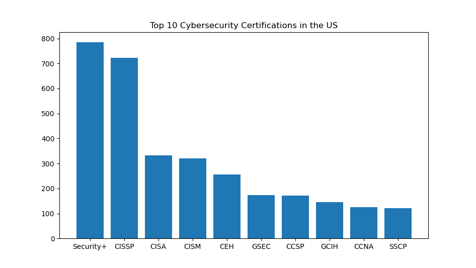

# common-security-certifications
Please note that I am excluding values that occur less than 1% of the number of job postings processed.

## September 2025
Searching for 'cyber' jobs in the United Kingdom.

The raw values are:
{'CISSP': 299, 'CISM': 181, 'Security+': 118, 'CEH': 100, 'CISA': 79, 'OSCP': 68, 'CRISC': 50, 'CCNA': 47, 'GCIH': 44, 'SAAS': 36, 'GCFE': 34, 'CRT': 32, 'CCSP': 31, 'CPSA': 30, 'Cloud+': 29, 'CISMP': 29, 'GCFA': 28, 'GCIA': 24, 'ECSA': 24, 'GPEN': 23, 'ECIH': 22, 'SCCM': 20, 'GREM': 19, 'GNFA': 19}

Searching for 'cyber' jobs in the United States.

The raw values are:
{'Security+': 786, 'CISSP': 722, 'CISA': 332, 'CISM': 321, 'CEH': 256, 'GSEC': 174, 'CCSP': 172, 'GCIH': 146, 'CCNA': 126, 'SSCP': 122, 'CRISC': 101, 'GCFA': 98, 'GCIA': 95, 'OSCP': 94, 'CAP': 81, 'GNFA': 77, 'Cloud+': 71, 'GICSP': 57, 'Network+': 53, 'CND': 52, 'CCNP': 51, 'GMON': 50, 'GREM': 44, 'GCED': 43, 'SC-200': 41, 'GCFE': 40, 'CASP+': 35}
